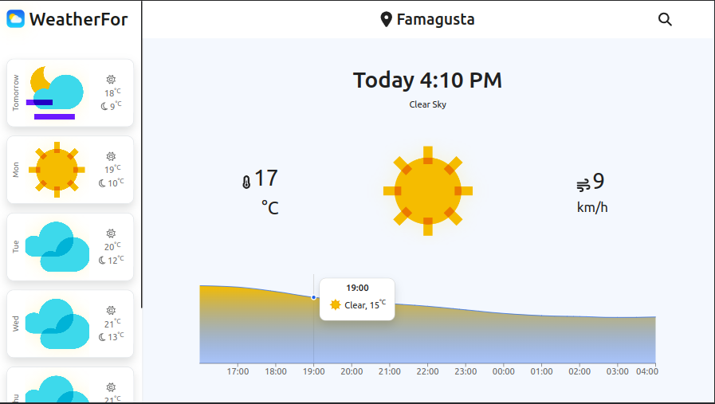
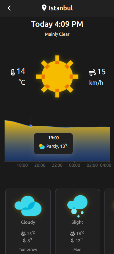

# React-Weather

Weather forecast application for web browsers with React JS.


## Appendix

This project was updated with React JS.

## Authors

- [@hsyntes](https://www.github.com/hsyntes)

## Features

- Light/dark mode by sunset and sunrise
  


- Searcing all cities in the world
  

- Live weather data for your location
  

## Run Locally

Clone the project

```bash
  git clone https://github.com/hsyntes/react-weather
```

Go to the project directory

```bash
  cd my-project
```

Install dependencies

```bash
  npm install
```

Start the server

```bash
  npm run start
```
