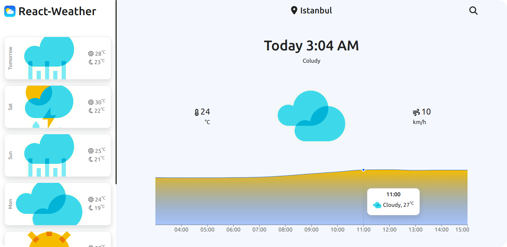
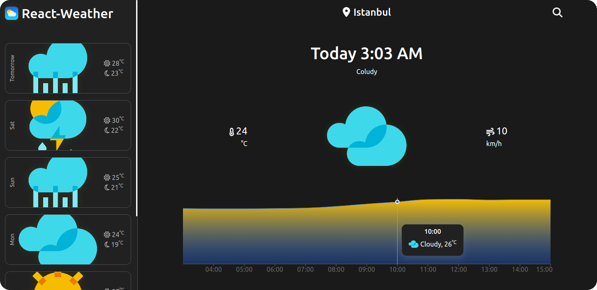
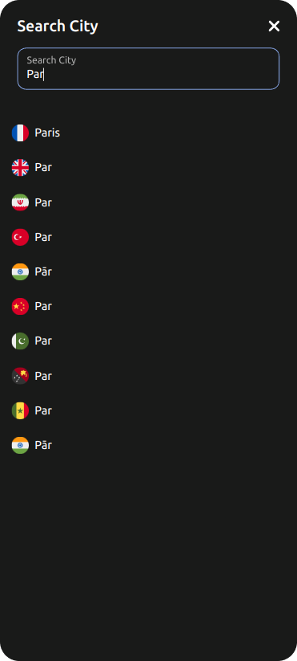
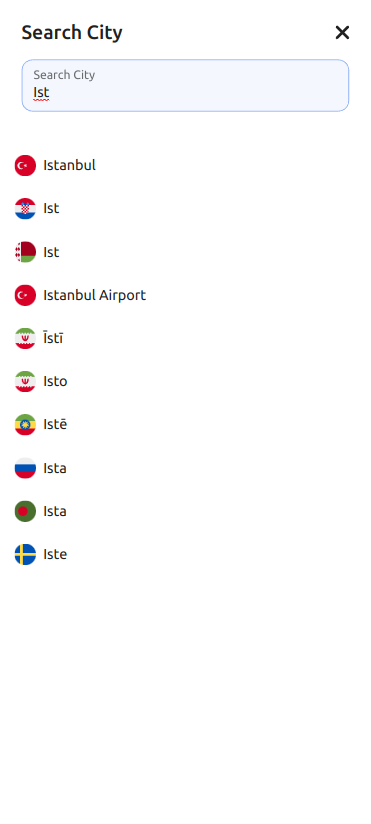
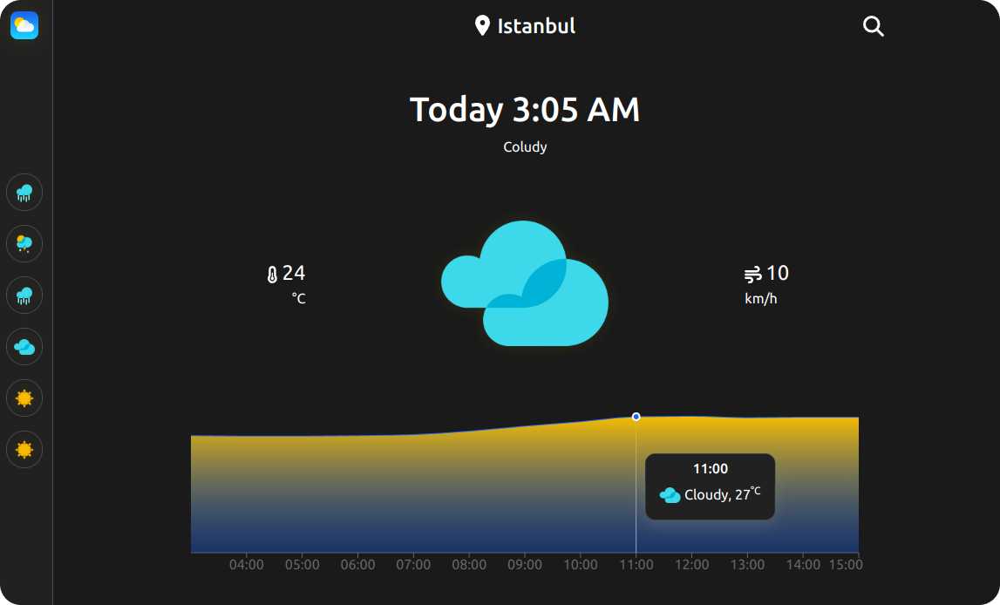
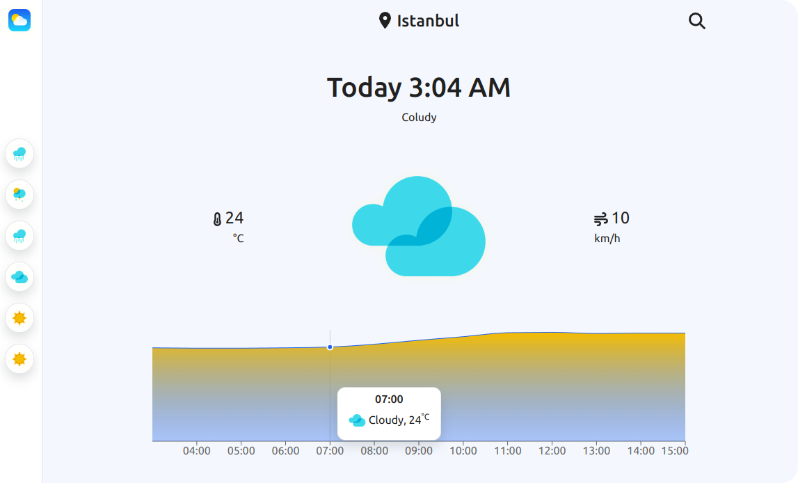

# React-Weather

Weather forecast application for web browsers with React JS.

[React-Weather](https://weatherfor.netlify.app)


## Appendix

This project was updated with React JS.

## Authors

- [@hsyntes](https://www.github.com/hsyntes)

## Features

- Light/dark mode by sunset and sunrise





- Searcing all cities in the world

 

- Live weather data for your location and searched city





## Run Locally

Clone the project

```bash
  git clone https://github.com/hsyntes/react-weather
```

Go to the project directory

```bash
  cd react-weather
```

Install dependencies

```bash
  npm install
```

Start the server

```bash
  npm start
```

## Feedback

If you have any feedback, please reach out to me at below links.

## 🔗 Links

[](https://www.linkedin.com/in/hsyntes)
[](https://twitter.com/hsyntes)
